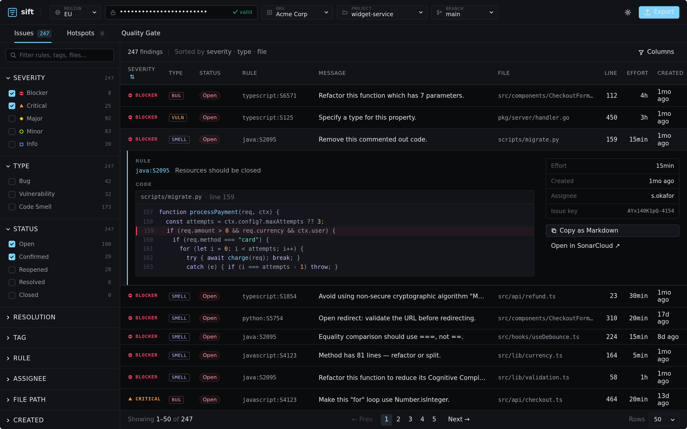

# Sift

> A one-page browser dashboard for SonarCloud findings — issues, security hotspots, and quality-gate status — with Markdown / CSV export designed for LLM-assisted remediation planning.

**[Live demo → sift-red.vercel.app](https://sift-red.vercel.app)** · **v1.0.0** — all 12 phases shipped.



## Why

SonarCloud is excellent at finding issues but deliberately discourages exporting them. That is fine when you are fixing one issue at a time in your IDE; it is not fine when you are triaging a backlog, briefing a team, or asking an LLM to draft a remediation plan. Sift fills the gap without ever persisting your token on a server.

See [`SPEC.md`](./SPEC.md) for the full product specification and [`ARCHITECTURE.md`](./ARCHITECTURE.md) for the modular architecture.

## Privacy callout

- Your SonarCloud token never persists on a server.
- The proxy that fronts the SonarCloud API is **stateless**: no logging of tokens, request bodies, or headers; no caching; no persistence. Code lives in [`proxy/`](./proxy) and is ~50 lines of vendor-neutral logic plus thin platform adapters.
- The app ships zero third-party scripts: no analytics, no error reporters. Verified by CI.
- The full threat model lives in [`SECURITY.md`](./SECURITY.md).

## Status & roadmap

Sift is being built in 12 phases per [`IMPLEMENTATION.md`](./IMPLEMENTATION.md). v1.0 ships when Phase 12 lands. Roadmap items beyond v1.0 (SonarQube Server support, saved filter presets, trend view) are tracked in [`SPEC.md`](./SPEC.md) §15.

## Quick start (developers)

Requires [pnpm](https://pnpm.io) and Node 20 LTS.

```bash
pnpm install
pnpm dev          # local dev server
pnpm test         # vitest, watch with pnpm test:watch
pnpm e2e          # playwright against the built app
pnpm lint         # eslint
pnpm typecheck    # tsc --noEmit
pnpm build        # production bundle
```

## Self-host

Sift is a static SPA plus a ~60-line stateless edge proxy. There is nothing to provision, no database, no persistent state.

### Vercel (canonical, zero-config)

```bash
# 1. Fork or clone this repo
# 2. Push to GitHub and import the repo into Vercel
#    Framework preset: Vite  |  Build command: pnpm build  |  Output dir: dist
# 3. No environment variables are required for v1.0
```

The proxy function lives in `api/sonar/[...path].ts` and is auto-deployed by Vercel as a Serverless Function. Vercel detects it from the `api/` directory with no extra configuration.

### Cloudflare Workers

A Cloudflare Workers adapter is provided in `proxy/adapters/cloudflare.ts`. Full instructions are in [`docs/deploy-cloudflare.md`](./docs/deploy-cloudflare.md).

### Other platforms

Any platform that can serve a Vite SPA and run a small Node.js or Web Standards function works. Point the platform at `proxy/core.ts` (vendor-neutral, ~60 lines, no imports beyond Web Standards) and expose it under `/api/sonar/v1/` on the same origin as the SPA.

### Build-time configuration (env vars)

Self-hosters can override the cold-start defaults at build time without forking the code. Set these in your hosting platform's environment-variable settings (e.g. `vercel env add VITE_DEFAULT_STORAGE_MODE production`). A persisted user choice always wins over these defaults; they only affect first-time visitors.

| Variable                    | Values                                    | Default | Effect                                                                                                                                                                                               |
| --------------------------- | ----------------------------------------- | ------- | ---------------------------------------------------------------------------------------------------------------------------------------------------------------------------------------------------- |
| `VITE_DEFAULT_STORAGE_MODE` | `local` / `session` / `cookie` / `memory` | `local` | Where the SPA holds the SonarCloud token by default. Pick `session` for shared-machine deployments where tokens shouldn't survive tab close. See [`SECURITY.md`](./SECURITY.md#token-storage-modes). |
| `VITE_DEFAULT_REGION`       | `eu` / `us`                               | `eu`    | SonarCloud region pre-selected for new users. Pick `us` for organisations on `sonarqube.us`.                                                                                                         |

## FAQ

**Does Sift store my token?**
Your token is held in the browser only (localStorage by default, or sessionStorage / cookie / memory — your choice in Settings). It is never sent to any server other than SonarCloud via the stateless proxy. See [`SECURITY.md`](./SECURITY.md).

**Does the proxy log anything?**
No. The proxy is stateless: no logging of tokens, request bodies, or headers; no caching; no persistence of any kind. Verified by CI.

**Can I use this with SonarQube Server (self-managed)?**
v1.0 supports SonarCloud (EU at `sonarcloud.io` and US at `sonarqube.us`). SonarQube Server support is planned for v1.1.

**What happens if I have thousands of issues?**
Sift fetches up to 10,000 issues per query (SonarCloud's hard ceiling). If your project exceeds this, Sift shows an over-cap warning with the total count and suggests narrowing filters before exporting.

**Can I contribute?**
Yes. See [`CONTRIBUTING.md`](./CONTRIBUTING.md).

## Contributing

See [`CONTRIBUTING.md`](./CONTRIBUTING.md). In short: trunk-based, Conventional Commits, TDD, small PRs.

## License

MIT — see [`LICENSE`](./LICENSE). Inbound contributions are licensed under the same terms (see `CONTRIBUTING.md`). Project name and logo are not covered by the code license; see [`TRADEMARK.md`](./TRADEMARK.md).
